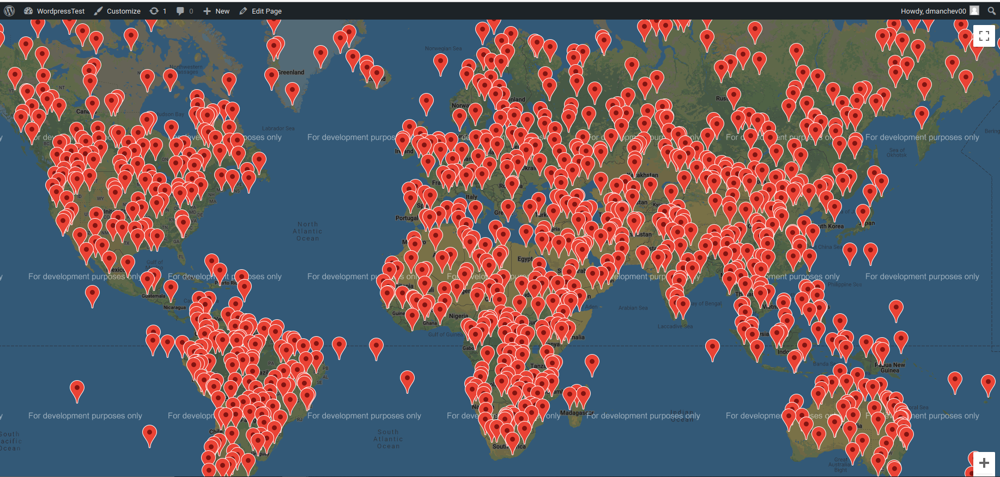

# Wordpress-GoogleMapsTask

<ul>
  
  <li> In the <b>PHP</b> folder is the logic for inserting more points in the database and encoding in JSON the information about the points' coordinates.
  
  <li> In <b>index.html</b> I create a simple map. I use google maps' developer API in order to get access to the marker function.
    
</ul>

The result of the program is:

The UI of the filters menu is:

TODO

Better UI.
